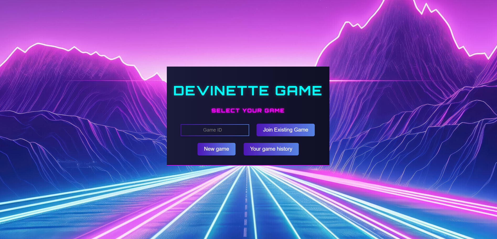
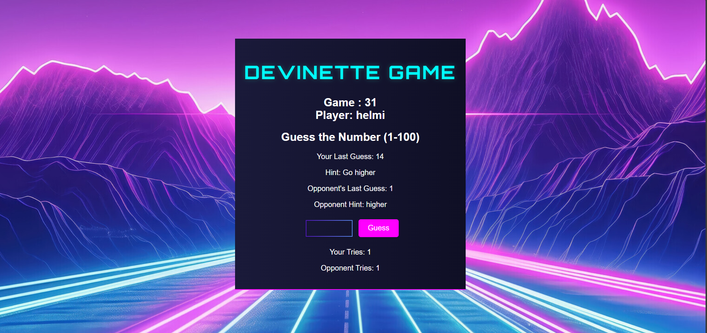
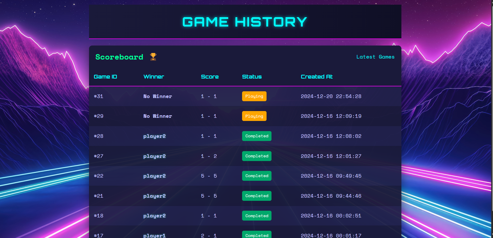

Devinette Game 🎲
A fun and interactive multiplayer guessing game developed using HTML, CSS, JavaScript, PHP, and MySQL.
📌 Features
Two-Player Mode: Play against another player in real-time.
Game History: Track the progress of all played games.
Dynamic Hints: Receive helpful hints to guess the secret number.
Interactive UI: Simple and engaging interface.
🛠️ Technologies Used
Frontend: HTML, CSS, JavaScript
Backend: PHP
Database: MySQL
Version Control: Git and GitHub
📋 Database Schema
game_sessions Table
This table stores information about each game session:
CREATE TABLE IF NOT EXISTS game_sessions (
    id INT AUTO_INCREMENT PRIMARY KEY,
    secret_number INT NOT NULL,
    player1_ready BOOLEAN DEFAULT FALSE,
    player2_ready BOOLEAN DEFAULT FALSE,
    player1_tries INT DEFAULT 0,
    player2_tries INT DEFAULT 0,
    last_guess_player1 INT NULL,
    last_guess_player2 INT NULL,
    hint_player1 VARCHAR(10) NULL,
    hint_player2 VARCHAR(10) NULL,
    winner VARCHAR(10) NULL,
    game_status ENUM('waiting', 'playing', 'completed') DEFAULT 'waiting',
    created_at TIMESTAMP DEFAULT CURRENT_TIMESTAMP
);
CREATE TABLE IF NOT EXISTS users (
    id INT AUTO_INCREMENT PRIMARY KEY,
    username VARCHAR(50) NOT NULL UNIQUE,
    password_hash VARCHAR(255) NOT NULL
);

🖼️ Screenshots
🔵 Home Page
Welcome players with an interactive and engaging interface.

🔴 Two-Player Game Mode
Players guess the secret number with real-time feedback and hints.

🟢 Game History
Review past games, winners, and player stats.

🚀 Getting Started
Prerequisites
PHP (v7.4 or later)
MySQL
A web server (e.g., Apache, Nginx, or XAMPP)
Installation
Clone the repository:

bash
Copy code
git clone https://github.com/Helmi555/Devinette-Game.git
Navigate to the project directory:

bash
Copy code
cd Devinette-Game
Set up the database:

Create a new database in MySQL.
Import the database schema provided in db_schema.sql.
Configure the database connection in the config.php file.

Start your local web server and open the project in a browser.

🎉 How to Play
Two players join the game.
Each player guesses the secret number, and the system provides hints.
The first player to guess the number correctly wins!
Track your performance in the game history.
🏆 Contributions
Contributions are welcome! Feel free to fork the repository and create pull requests.

